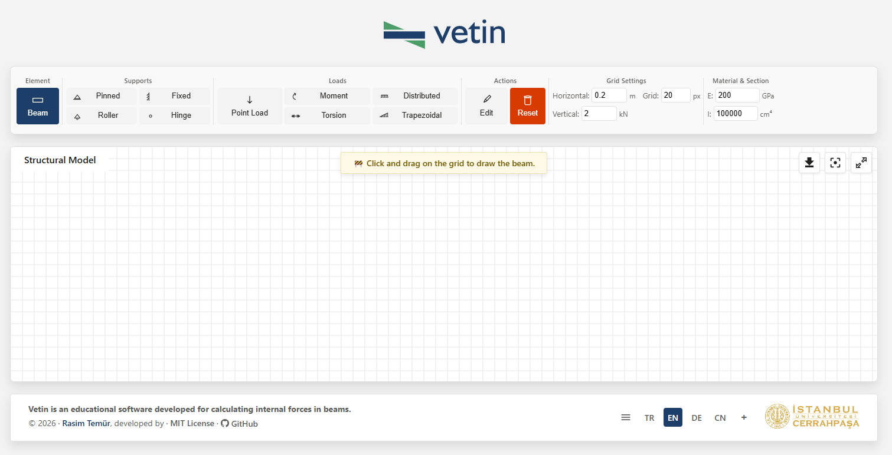
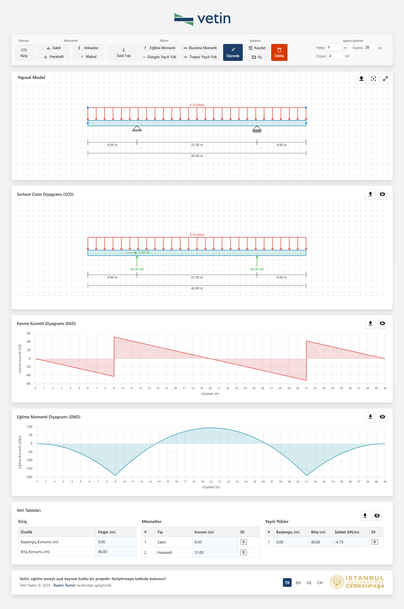

# Vetin | Beam Analysis

**A browser-based computational tool for the determination of internal forces and elastic deformation in beam structures.**

[](https://opensource.org/licenses/MIT)
[](https://web.dev/progressive-web-apps/)
[](#-multilingual-support)
[](https://www.rasimtemur.com/vetin/beam/)

> Developed by **Assoc. Prof. Rasim Temür** · Istanbul University-Cerrahpaşa, Department of Civil Engineering  
> Part of the **Vetin** initiative for the digitisation of academic instruction tools.

---

## 🌐 Online Access

> **[https://www.rasimtemur.com/vetin/beam/](https://www.rasimtemur.com/vetin/beam/)**

The application is accessible directly through a web browser without requiring any software installation, user registration, or server-side processing. All computations are performed client-side.

---

## 📸 Screenshots

<table>
  <tr>
    <td align="center"><b>Structural Model &amp; Toolbar</b></td>
    <td align="center"><b>Internal Force Diagrams</b></td>
    <td align="center"><b>3D Elastic Curve</b></td>
  </tr>
  <tr>
    <td></td>
    <td></td>
    <td></td>
  </tr>
</table>

---

## 📋 Description

**Vetin Beam Analysis** is an open-source, web-based software developed for educational use in structural mechanics and civil engineering curricula. The application enables the interactive graphical definition of beam structural models, and produces instantaneous visual representations of internal force distributions and elastic deformation curves — entirely within the web browser environment.

The software is intended to support both undergraduate instruction and self-directed learning by providing immediate visual feedback on the structural response of beam systems under various loading and boundary conditions.

**Key properties of the application:**

- Operates entirely within the client browser; no server-side computation is required
- Functions offline as a **Progressive Web App (PWA)**, compatible with major desktop and mobile platforms
- User interface is localised in **more than 10 languages**
- Source code is freely distributed under the **MIT License**

---

## ⚙️ Functional Capabilities

### Structural Model Definition

The user defines the structural model interactively on a calibrated grid canvas. All elements are positioned with snap-to-grid precision and may be repositioned or modified at any stage of model construction.

### Boundary Conditions

The following support conditions are available for model definition:

| Symbol | Boundary Condition | Mechanical Behaviour |
|--------|-------------------|----------------------|
| △ | **Pinned Support** | Restrains vertical and horizontal translation; permits rotation |
| ○△ | **Roller Support** | Restrains vertical translation; permits horizontal translation and rotation |
| ▐ | **Fixed Support (Cantilever)** | Restrains all translational and rotational degrees of freedom |
| ◉ | **Internal Hinge** | Introduces a moment release at the specified location |

### Applied Loading

The following load types may be applied to the structural model:

| Load Type | Description |
|-----------|-------------|
| **Concentrated (Point) Load** | A discrete force applied at a specified position and inclination angle |
| **Bending Moment** | A concentrated moment applied at a specified cross-section |
| **Uniformly Distributed Load** | A load of constant intensity applied over a defined span |
| **Trapezoidal (Linearly Varying) Load** | A load with linearly varying intensity between two specified magnitudes |
| **Torsional Moment** | A concentrated torsional moment applied at a specified cross-section |

### Computed Output

Upon definition of the structural model, the following diagrams are generated automatically:

- **FBD** — Free Body Diagram, including computed support reactions
- **AFD** — Axial Force Diagram
- **SFD** — Shear Force Diagram
- **BMD** — Bending Moment Diagram
- **TMD** — Torsional Moment Diagram
- **ECD** — Elastic Curve Diagram (two-dimensional deflection profile)
- **3D Elastic Curve** — Three-dimensional interactive visualisation of the deformed beam geometry, rendered via WebGL

### Material and Cross-Section Properties

The elastic curve computation requires the specification of:

- **Modulus of Elasticity (E)** — expressed in GPa
- **Second Moment of Area (I)** — expressed in cm⁴

### Data Management

- **Save / Open** — The structural model may be exported to and imported from a `.json` file, enabling session continuity
- **Diagram Export** — Any computed diagram may be downloaded as a PNG image file
- **Data Export** — Tabulated numerical output may be downloaded for external reference

### Interface Options

- **Light / Dark mode** — selectable display theme
- **Fullscreen mode** — for unobstructed model construction
- **Configurable grid** — horizontal scale (m), vertical scale (kN), and grid resolution (px)
- **Contextual guidance** — a dynamic hint panel provides task-specific usage instructions for each selected tool

---

## 🌐 Multilingual Support

The user interface is fully localised in more than 10 languages. The active language is selectable at runtime and persisted across sessions via `localStorage`:

| Code | Language | Code | Language |
|------|----------|------|----------|
| `tr` | 🇹🇷 Turkish | `en` | 🇬🇧 English |
| `de` | 🇩🇪 German | `cn` | 🇨🇳 Chinese |
| `es` | 🇪🇸 Spanish | `fr` | 🇫🇷 French |
| `it` | 🇮🇹 Italian | `pt` | 🇧🇷 Portuguese |
| `ar` | 🇸🇦 Arabic | `ja` | 🇯🇵 Japanese |
| `ko` | 🇰🇷 Korean | `ru` | 🇷🇺 Russian |

---

## 🛠️ Technical Implementation

The application is implemented using standard web technologies without dependency on a JavaScript framework:

| Technology | Role |
|-----------|------|
| **HTML5 / CSS3 / JavaScript (ES6+)** | Core application architecture |
| **[Chart.js](https://www.chartjs.org/)** | Rendering of 2D internal force diagrams |
| **[D3.js](https://d3js.org/)** | SVG-based structural diagram drawing |
| **[Three.js](https://threejs.org/)** | WebGL-based 3D elastic curve visualisation |
| **Service Worker API** | Offline caching and PWA functionality |
| **Web App Manifest** | Home screen installation support |

---

## 📁 Project Structure

```
beam/
├── index.html              # Application entry point and HTML shell
├── manifest.json           # PWA manifest descriptor
├── sw.js                   # Service Worker (offline caching)
│
├── app.js                  # Application state management
├── main.js                 # Initialisation sequence
├── setup.js                # Canvas and grid configuration
├── calculations.js         # Internal force and reaction computations
├── ui-handler.js           # User interface state and event dispatch
│
├── draw-structure.js       # Beam and support element rendering
├── draw-loads.js           # Load visualisation
├── draw-utilities.js       # Shared drawing utilities
├── elastic-3d.js           # Three.js-based 3D elastic curve renderer
│
├── desktop-events.js       # Mouse and keyboard event handling
├── mobile-events.js        # Touch event handling
├── download.js             # PNG and JSON export logic
│
├── translations.js         # Localisation string repository
├── localization.js         # Language switching and i18n engine
│
├── common.css              # Base styles and design tokens
├── desktop-layout.css      # Desktop viewport layout
├── mobile-layout.css       # Mobile viewport layout
├── controls-3d.css         # 3D viewer control panel styling
│
├── logo.svg                # Application logotype
├── icon-192.png            # PWA icon (192 × 192 px)
└── icon-512.png            # PWA icon (512 × 512 px)
```

---

## 🚀 Deployment and Local Execution

### Online Access (Recommended)

The application is hosted and publicly accessible at:  
**[https://www.rasimtemur.com/vetin/beam/](https://www.rasimtemur.com/vetin/beam/)**

### Local Execution

As the application comprises static files only, it may be served locally using any HTTP server:

```bash
# Clone the repository
git clone https://github.com/rasimtemur/vetin-beam.git
cd vetin-beam

# Python 3 — built-in HTTP server
python -m http.server 8000

# Node.js — via npx
npx serve .
```

Navigate to `http://localhost:8000` in a web browser to launch the application.

### Installation as a Progressive Web App

On browsers supporting the PWA specification (Chromium-based browsers, Firefox, Safari on iOS), the application may be installed to the device home screen or desktop via the browser's **"Install"** or **"Add to Home Screen"** functionality, enabling offline access.

---

## 📖 Usage

1. **Define the beam** — Activate the *Beam* tool and drag across the canvas to establish the beam axis and span.
2. **Assign boundary conditions** — Select a support type from the toolbar and click the desired location on the beam.
3. **Apply loading** — Select a load type and interact with the beam to define load position, magnitude, and direction as applicable.
4. **Examine results** — Internal force diagrams and reaction values are updated instantaneously following each model modification.
5. **Adjust deformation scale** — The *Displacement Scale* parameter may be increased to amplify the elastic curve for visual clarity.
6. **Export output** — Diagrams may be saved as PNG images; the full model may be saved as a JSON file for subsequent sessions.

> **Note:** A contextual hint panel is displayed below the canvas at all times, providing guidance specific to the currently active tool.

---

## 📐 Computational Methodology

- **Support reactions** are determined from the conditions of static equilibrium.
- **Internal force distributions** (axial force *N*, shear force *V*, bending moment *M*, torsional moment *T*) are obtained through numerical integration of the applied loading along the beam axis.
- **Elastic deformation** is computed by double integration of the bending moment diagram in accordance with the Euler–Bernoulli beam theory, utilising the specified values of *E* (modulus of elasticity) and *I* (second moment of area).
- The **three-dimensional elastic curve** provides a simultaneous representation of flexural (vertical) and torsional (lateral) deformations.

---

## 📜 License

This software is distributed under the **MIT License**.  
Full license terms are available in the [LICENSE](LICENSE) file.

---

## 👤 Developer

**Assoc. Prof. Rasim Temür**  
Department of Civil Engineering  
Istanbul University-Cerrahpaşa  
🌐 [rasimtemur.com](https://www.rasimtemur.com)

---

## 🔗 Vetin Project

Vetin is a collection of open-source, browser-based computational tools developed for use in civil and structural engineering education. Additional tools within the Vetin ecosystem are accessible at **[rasimtemur.com/vetin](https://www.rasimtemur.com/vetin)**.

---

<p align="center">
  <i>Developed in support of engineering education.</i><br>
  <a href="https://github.com/rasimtemur/vetin-beam">GitHub</a> ·
  <a href="https://opensource.org/licenses/MIT">MIT License</a> ·
  <a href="https://www.iuc.edu.tr">Istanbul University-Cerrahpaşa</a>
</p>
